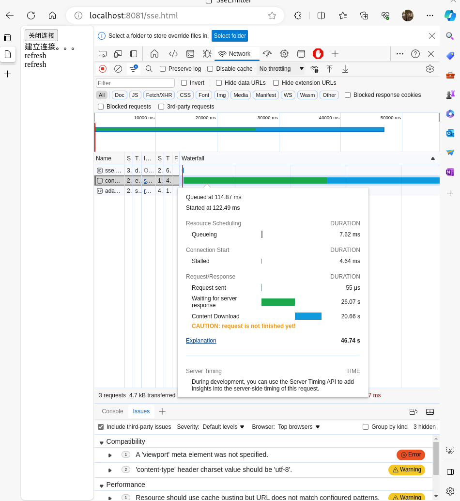
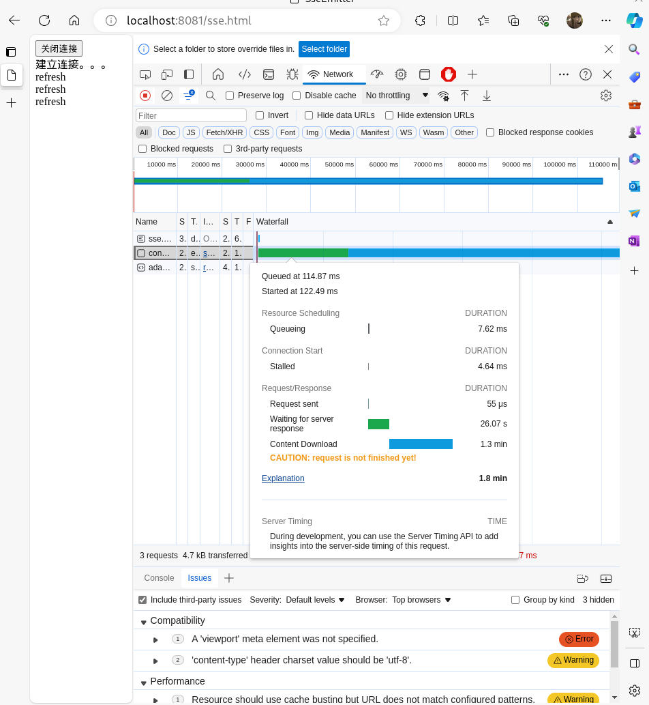

## JWT + Redis 实现分布式toke与自动续期

#### JWT简述

Json web tokens，由三部分组成：头部，负载，签名。前两部分是JSON格式数据并用base64编码体现在jwt中。

头部存放jwt类型和签名使用的加密算法。负载可以存放全局的、经常使用的、安全要求不高的业务数据。

签名使用服务器持有的密钥通过对头部和负载进行摘要算法生成。
由此，密钥以及摘要算法、头部和负载唯一确定一个token，也就是当这些信息都一致时会生成相等的token。

在服务启动时生成随机密钥，用于 `JWT`（Json Web tokens）的颁发与解析。

为应对分布式场景下 `JWT` 的可用性（要求jvm2号能解析jvm1号颁发的`token`）， 在每次颁发 `token` 时，将 `token - secretKey` ，作为键值存入 Redis，并设置相比 `JWT` 二倍过期时间。

每次解析指定 `token` 时，先去 Redis 根据传来的 `token` 判断其合法性以及拿到解析它所需要的密钥，以及它的剩余有效时间。

当 `token` 不存在于 Redis 时， 鉴权失败 —— `token` 不正确或已过期；

当 `token` 存在于 Redis 时，拿到 secretKey 去解析它， 并对比它在 Redis 的剩余有效时间与为 `JWT` 的颁发时设置的有效时间：

  * 如果 `ttl_redis > expire_jwt` ，说明 `JWT` 还有效；
  * 如果 `ttl_redis <= expire_jwt` ，说明 `JWT` 自身已失效，需要重新颁发 `JWT` 给这位用户，并在 Redis 中删除旧的插入新的 `token` 。

#### 考虑边界

* 同浏览器登陆不同账号时，后端一共生成并返回了两个不同的token，前端发生了token覆盖，先登陆的账号用户会变成后登陆用户。

* 多端登陆同一账号，如果登陆间隔大于1s，会得到不同的token，独立进行自动续期（经常使用edge端，那久了chrome会下线）
    
  为什么token不同？1s哪来的？ 负载存有过期时间信息，JWT保存的过期时间单位为秒。极端情况多端在1s内的同时登陆，那可能得到同样的token。（但经常使用edge端，那久了chrome会下线，因为JWT的token续期不是续期自身而是重新生成新token）。
    反之（登陆间隔超过1s）那就必然有不同的过期时间（过期时间记录的是过期的时刻，不是ttl），得到的token也便不同。

## SSE（服务发送事件）实现服务端消息主动推送

用一次http请求/响应交互实现服务端主动消息推送，基于SpringMVC SseEmitter（底层使用异步请求），商家端的SSE连接请求在处理后不会立刻结束响应，响应仍处于open状态（这是由异步线程去保持的，web容器中的工作线程被归还），用户下单线程调用`sseEmitter.send(msg)`，在响应中
写入消息，异步线程去做消息的推送。这比短轮询节省了大量的无效请求；比长轮询较少了请求数以及避免了长轮询两次轮询间消息丢失风险；相比WebSocket则对场景更适应（单向消息推送即可），并且实现更简单。

下面是处理SSE连接请求的日志，`exec-3`及时退出，使用了异步处理：
```bash
2023-11-30T12:07:48.913+08:00 DEBUG 26510 --- [nio-8081-exec-3] o.s.web.servlet.DispatcherServlet        : GET "/sse/connect?token=xxx", parameters={masked}
2023-11-30T12:07:48.914+08:00 DEBUG 26510 --- [nio-8081-exec-3] s.w.s.m.m.a.RequestMappingHandlerMapping : Mapped to com.mizore.mob.controller.SseController#connect()
2023-11-30T12:07:49.036+08:00  INFO 26510 --- [nio-8081-exec-3] com.mizore.mob.message.SseServer         : 创建新的sse连接，当前用户：staff:5
2023-11-30T12:07:49.039+08:00 DEBUG 26510 --- [nio-8081-exec-3] o.s.w.c.request.async.WebAsyncManager    : Started async request
2023-11-30T12:07:49.040+08:00 DEBUG 26510 --- [nio-8081-exec-3] o.s.web.servlet.DispatcherServlet        : Exiting but response remains open for further handling
```
在用户进入页面时（需要实时消息推送的页面），前端发起SSE连接，后端持有这个连接，存入容器，直到用户离开这个页面，前端发送撤销连接的请求，后端执行连接结束的回调函数清除连接。

在用户停留在 SSE 页面时，SSE 连接保持。当目标事件发生，事件执行方需要遍历 SSE 连接容器中维持的连接，调用连接对象的发送消息方法，让后端将消息推送给前端。

请求首部`accept:text/event-stream`，表示这个请求期望获取到服务器推送的数据(Server-sent events)。

`text/event-stream` 是服务器推送数据的一种格式,它允许服务器通过 HTTP 协议持续向客户端推送数据,而不是由客户端发起请求获取。

服务器对同一SSE请求的多次消息推送，实际上并没有多次发送http响应，而是一次持续时间较长的响应，在维护SSE连接期间，会有来自服务端的事件流通过这个未结束的响应持续
推送到客户端，直到连接关闭，这次请求才算完成。




连接关闭可以由服务端主动关闭也可以有客户端主动关闭（服务端推送“关闭SSE连接”的事件来通知客户端），较为灵活。

## 自定义注解 + SpringAOP + Redis 实现接口的幂等性

编写用在控制器方法上的注解 `IdempotentAspect`，编写切面类写对该注解所标识方法的环绕通知：

将用户id + 方法名 + 参数类型 + 参数值 作哈希，作为键使用 `setnx` 命令存入 Redis 并设置指定过期时间（该时间内保证接口的幂等性）。

`setnx`适合用在分布式锁在于它的天然查重，那么同理可以用于接口的幂等性判断。
将键哈希后存入 Redis 节能 Redis 内存与便于字符串比较，但有概率发生哈希冲突，导致有效请求被作为重复请求无效处理。
对策是 `setnx` 将用户id作为值。在发现键已存在时，取到值，对比请求的用户id与 Redis 中存的用户id是否一致：

  * 一致，则判定为重复请求，无效化该请求；
  * 不一致，则发生了哈希冲突，该请求实际是有效请求，正常处理它。

那要是发生哈希冲突的新用户紧接着也做了重复误请求呢，不就没办法拦截了？确实，这是没能解决的小概率情况——不仅哈希冲突了而且还发生误重复操作。

我能想到的解决方案是要么取消键哈希；要么不再使用 Redis字符串的 `setnx` 操作，改用 Redis 的 `set` 数据结构：

键依旧哈希，值存放所有对该键产生冲突的用户id，是一个集合。但这也有一个问题：它们是公用同个键值对的过期时间的。请求的时间不一致却共用幂等判断ttl，并不合理。

## 关于订单查询接口：

### 订单状态说明：
* 1：待接单-用户完成支付但待商家确认，
* 2：备餐中-商家确认后处于备餐中，
* 3：待配送-备餐完毕等待骑手配送，
* 4：配送中-骑手抢单后到送达前，
* 5：已送达并未评价-骑手送达，
* 6：已评价-用户提交评价，订单完成。

### 类型一：根据状态查询订单


**1. 顾客查看自己所有待送达状态的订单（订单号，点餐内容（菜名+图片），总价，状态，配送员姓名（可能））：**

待送达状态：包括 状态为 1、 2、 3、 4 的订单

展示页面以订单号排序（因为订单号包含了创建时间信息，相当于以创建时间排序了）

后端返回**属于该用户**的并且**状态在区间 [1,4]** 的订单简略信息（包括订单号，点餐内容（菜名+图片），总价，状态）列表

如果状态为 4 ，即配送中，后端需额外返回每个订单的配送员姓名

<br>

**2. 顾客查看自己所有未评价的订单（订单号，点餐内容（菜名+图片），总价，状态）：**

后端返回**属于该用户**的并且**状态为 5** 的订单简略信息（包括订单号，点餐内容（菜名+图片），总价，状态）列表

<br>

**3. 顾客查看自己所有已评价的订单（订单号，点餐内容（菜名+图片），总价，状态）：**

后端返回**属于该用户**的并且**状态为 6** 的订单简略信息（包括订单号，点餐内容（菜名+图片），总价，状态）列表

<br>

**4. 商家查看所有待接单的订单（订单号，点餐内容（菜名+图片+数量+菜价），总价，状态，创建时间，顾客名）：**

后端返回所有 **状态为 1** 的订单简略信息（包括订单号，点餐内容（菜名+图片+数量+菜价），总价，状态，创建时间，顾客名）列表

<br>

**5. 商家查看所有已接单的订单（订单号，点餐内容（菜名+图片+数量+菜价），总价，状态，创建时间，顾客名）：**

后端返回所有 **状态在区间 [2,4]** 的订单简略信息（包括订单号，点餐内容（菜名+图片+数量+菜价），总价，状态，创建时间，顾客名）列表

<br>

**6. 商家查看所有已完成的订单（订单号，点餐内容（菜名+图片+数量+菜价），总价，状态，创建时间，顾客名）：**

这里对「已完成」的定义是已送达，包括未评价和已评价的。

后端返回所有 **状态在区间 [5,6]** 的订单简略信息（包括订单号，点餐内容（菜名+图片+数量+菜价），总价，状态，创建时间，顾客名）列表

<br>


**7. 骑手查看所有待接单订单（订单号，状态，点餐内容（菜名+图片），期望送达时间，地址）：**

后端返回所有 **状态为 3** 的订单简略信息（包括订单号，状态，点餐内容（菜名+图片），期望送达时间，地址）列表

<br>

**8. 骑手查看所有正在配送的订单（订单号，状态，点餐内容（菜名+图片），期望送达时间，地址）：**

后端返回所有**配送员为当前用户**的 **状态为 4** 的订单简略信息（包括订单号，状态，点餐内容（菜名+图片），期望送达时间，地址）列表

<br>

**9. 骑手查看所有已送达的历史订单（订单号，状态，点餐内容（菜名+图片），期望送达时间，实际送达时间，地址）：**

后端返回所有**配送员为当前用户**的 **状态为 5和6** 的订单简略信息（包括订单号，状态，点餐内容（菜名+图片），期望送达时间，实际送达时间，地址）列表


### 类型二：根据订单号查询指定订单详情


分类讨论如下：

**1. 顾客查看指定订单的详情：**

先去校验订单号对于的下单顾客是不是当前用户，防止订单泄漏。

对于未送达（状态小于 5 ）的订单，返回订单的订单号，状态，菜品名字图片价格数量，订单总价，用户地址姓名电话，备注内容，期望送达时间

对于状态为 5 的订单，在上述内容中多返回实际送达时间

对于状态为 6 的订单，多返回实际送达时间和评价内容

**2. 商家查看指定订单的详情：**

对于未配送（状态为 1、2、3 ）的订单，返回订单的订单号，状态，菜品名字图片价格数量，订单总价，用户地址姓名电话，备注内容，期望送达时间

对于配送中和送达未评价（状态为4、5）的订单，在上述内容中多返回配送员姓名+电话

对于已评价（状态为6）的订单，在上述内容中多返回配送员姓名+电话+评价内容
